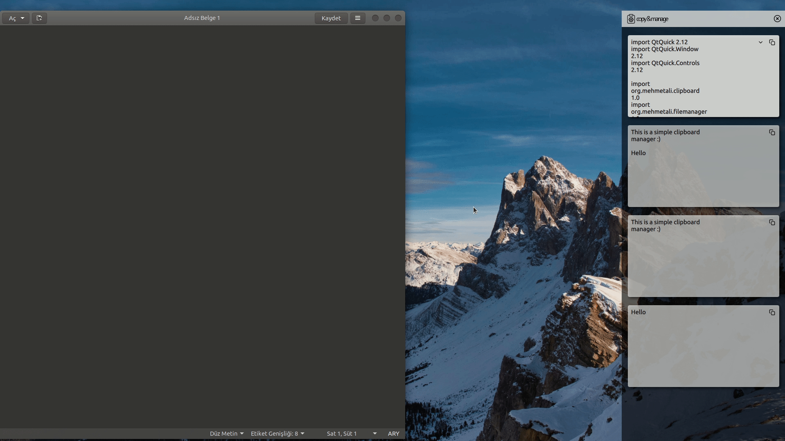

<h1> 
</h1>

## A simple QT based clipboard manager

> <h2> You can see and manage your old copied datas

- For now only support 'text' data


## Show Detail :



# Downloads and Installation

- Go to [release](https://github.com/mehmetalicayhan/copy-manage/releases/tag/1.0.0-b1) page and download .deb file

- Open a terminal and enter following command

```
  sudo dpkg -i copymanage-1.0.0-b1.deb
```

<br>

# Building from source code without QtCreator

- Download or clone source code

```
  git clone https://github.com/mehmetalicayhan/copy-manage.git
```

- Create build directory

```
  mkdir build
```

- Go to build directory

```
  cd build
```

- Enter following commands

```
  qmake ../
```

```
  make
```
